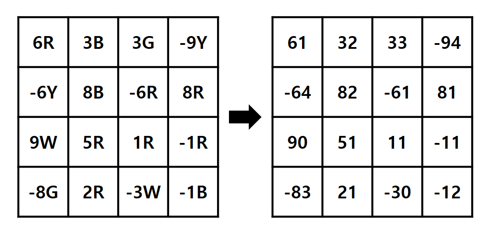

# 15898 피아의 아틀리에 ~신비한 대회의 연금술사~

## 문제

&nbsp;

참고:
https://www.acmicpc.net/problem/15898

&nbsp;

#

## 풀이

&nbsp;



가마와 재료들을 (품질/효능)(원소) 형태의 하나의 int 배열로 구성한다.  
각 원소들을 문자가 아닌 숫자('R' : 1, 'B' : 2, 'G' : 3, 'Y' : 4, 'W' : 0)로 표현한다.

&nbsp;

```java
int kilnElement =  kiln[r + i][c + j] % 10;
int kilnQuality = kiln[r + i][c + j] / 10;
```

가마 한 칸의 값이 94라면, 10으로 나눈 나머지 4가 원소가 되고 10으로 나눈 몫인 9가 품질이 된다.

&nbsp;

```java
    int ingredientElement = Math.abs(ingredient[i][j]) % 10;
    int ingredientEffect = Math.abs(ingredient[i][j]) / 10;

    if (ingredient[i][j] < 0) {
        ingredientEffect *= (-1);
    }
```

재료 한 칸의 값이 -94라면, 우선 절대값을 10으로 나눈 나머지(4)와 몫(9)을 구한다.  
재료 한 칸의 값이 음수인 경우 효능이 음수인 것이므로 효능에 -1을 곱한다.

&nbsp;

#

## 코드

```java
package week15;

import java.io.BufferedReader;
import java.io.IOException;
import java.io.InputStreamReader;
import java.util.Arrays;
import java.util.HashMap;
import java.util.Map;
import java.util.StringTokenizer;

public class Main_15898 {
    static int N;
    static int[][][] ingredients;
    static int answer;

    // 재료 3개 선택
    static void perm(int[][] kiln, boolean[] v, int depth) {
        if (depth == 3) {
            int totalQuality = calcTotalQuality(kiln);
            answer = Math.max(answer, totalQuality);
            return;
        }

        for (int i = 0; i < N; i++) {
            if (v[i]) {
                continue;
            }

            v[i] = true;

            // 선택한 재료를 회전 시키면서 가마 순회하기
            for (int row = 0; row < 2; row++) {
                for (int col = 0; col < 2; col++) {
                    int[][] ingredient = ingredients[i];

                    for (int rotate = 0; rotate < 4; rotate++) {
                        perm(addIngredient(kiln, ingredient, row, col), v, depth + 1);
                        ingredient = rotateIngredient(ingredient);
                    }
                }
            }

            v[i] = false;
        }
    }

    static int calcTotalQuality(int[][] kiln) {
        int[] elementQuality = new int[5];

        for (int i = 0; i < 5; i++) {
            for (int j = 0; j < 5; j++) {
                int element =  kiln[i][j] % 10;
                int quality = kiln[i][j] / 10;

                elementQuality[element] += quality;
            }
        }

        // 7R + 5B + 3G + 2Y
        return (7 * elementQuality[1] + 5 * elementQuality[2] + 3 * elementQuality[3] + 2 * elementQuality[4]);
    }

    static int[][] addIngredient(int[][] kiln, int[][] ingredient, int r, int c) {
        int[][] addedKiln = new int[5][5];
        for (int i = 0; i < 5; i++) {
			addedKiln[i] = Arrays.copyOf(kiln[i], 5);
		}

        for (int i = 0; i < 4; i++) {
            for (int j = 0; j < 4; j++) {
            	/*
            	ex) 가마 한 칸의 값이 94인 경우,
            		94 % 10 = 4 -> 원소
            		94 / 10 = 9 -> 품질
            	 */
                int kilnElement =  kiln[r + i][c + j] % 10;
                int kilnQuality = kiln[r + i][c + j] / 10;

                /*
            	ex) 재료 한 칸의 값이 -94인 경우,
            		|94| % 10 = 4 -> 원소
            		|94| / 10 = 9 -> 재료 한 칸이 음수라면 재료의 효능도 음수이므로 -1을 곱한다.
            	 */
                int ingredientElement = Math.abs(ingredient[i][j]) % 10;
                int ingredientEffect = Math.abs(ingredient[i][j]) / 10;
                if (ingredient[i][j] < 0) {
                    ingredientEffect *= (-1);
                }

                int newKilnQuality = kilnQuality + ingredientEffect;
                if (newKilnQuality < 0) {
                	newKilnQuality = 0;
                } else if (newKilnQuality > 9){
                	newKilnQuality = 9;
                }

                addedKiln[r + i][c + j] = newKilnQuality * 10;

                if (ingredientElement != 0) {
                    addedKiln[r + i][c + j] += ingredientElement;
                } else {
                    addedKiln[r + i][c + j] += kilnElement;
                }
            }
        }

        return addedKiln;
    }

    static int[][] rotateIngredient(int[][] ingredient) {
        int[][] rotatedIngredient = new int[4][4];

        for (int row = 0; row < 4; row++) {
            for (int col = 0; col < 4; col++) {
                rotatedIngredient[row][col] = ingredient[col][3 - row];
            }
        }

        return rotatedIngredient;
    }

    public static void main(String[] args) throws IOException {
        BufferedReader br = new BufferedReader(new InputStreamReader(System.in));
        StringTokenizer st;

        answer = 0;
        N = Integer.parseInt(br.readLine());
        ingredients = new int[N][4][4];
        Map<Character, Integer> elements = new HashMap<Character, Integer>();
        elements.put('W', 0);
        elements.put('R', 1);
        elements.put('B', 2);
        elements.put('G', 3);
        elements.put('Y', 4);

        // 재료 정보 설정
        for (int i = 0; i < N; i++) {
            for (int j = 0; j < 4; j++) {
                st = new StringTokenizer(br.readLine());

                for (int k = 0; k < 4; k++) {
                    ingredients[i][j][k] = Integer.parseInt(st.nextToken()) * 10;
                }
            }

            for (int j = 0; j < 4; j++) {
                st = new StringTokenizer(br.readLine());

                for (int k = 0; k < 4; k++) {
                	// 재료의 효능이 음수인 경우, 원소를 빼준다.
                	// ex) 효늉 : -9 / 원소 : 4 => -94
                    if (ingredients[i][j][k] >= 0) {
                        ingredients[i][j][k] += elements.get(st.nextToken().charAt(0));
                    } else { // 재료의 효능이 양수인 경우, 원소를 더한다.
                    		// ex) 효늉 : 9 / 원소 : 4 => 94
                        ingredients[i][j][k] -= elements.get(st.nextToken().charAt(0));
                    }
                }
            }
        }

        int[][] kiln = new int[5][5];
        perm(kiln, new boolean[N], 0);

        System.out.println(answer);
        br.close();
    }
}
```
