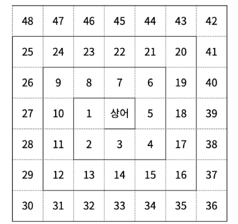

# 21611 마법사 상어와 블리자드

## 문제

&nbsp;

참고:
https://www.acmicpc.net/problem/21611

&nbsp;

#

## 풀이

&nbsp;

모든 기능을 2차원 배열에서 다음 그림의 순서와 동일하게 처리한다.



&nbsp;

```java
    int[] dr = {1, 0, -1, 0};
    int[] dc = {0, 1, 0, -1};

    int r = N / 2;
    int c = N / 2;

    for (int i = 0; i <= N / 2; i++) {
        System.out.println(map[r][c]);

        for (int j = 0; j < 4; j++) {
            r += dr[j];
            c += dc[j];

            while (Math.abs(r - N / 2) <= i && Math.abs(c - N / 2) <= i) {
                System.out.println(map[r][c]);

                r += dr[j];
                c += dc[j];
            }

            if (j < 3) {
                r -= dr[j];
                c -= dc[j];
            }
        }
    }
```

2차원 배열이 위 그림의 순서와 같이 동작하는지 확인하기 위한 배열 출력 코드이다. (실제 코드에선 배열을 출력하지 않는다.)

우선 시작점을 상어의 위치인 배열의 정중앙으로 설정하고, (하, 우, 상, 좌)의 방향으로 이동한다.  
이동 방향의 순서가 (좌, 하, 우, 상)이 아닌 이유는 한 턴이 종료하는 기준을 상어의 위치에서 현재 위치가 얼마나 떨어져 있는가(i)로 하기 때문이다. 현재 위치가 i보다 크면 방향을 바꾼다.

&nbsp;

-   **마법 시전**

```java
    static void castSpells(int d, int s) {
        int r = N / 2;
        int c = N / 2;

        for (int i = 0; i < s; i++) {
            r += directions[d][0];
            c += directions[d][1];

            map[r][c] = 0;
        }

        moveMarbles();
    }
```

상어의 위치를 기준으로 방향을 따라서 사정 거리에 속하는 칸을 0으로 바꾼다.

&nbsp;

-   **구슬 이동**

```java
    if (i > 0 && map[r][c] == 0) {
        q.offer(new int[] {r, c});
    } else {
        if (q.size() > 0) {
            int[] newPosition = q.poll();

            map[newPosition[0]][newPosition[1]] = map[r][c];
            map[r][c] = 0;
            q.offer(new int[] {r, c});
        }
    }
```

구슬 이동 또한 상어의 위치에서 시작하며, 앞서 보여준 그림의 순서대로 동작한다.

해당 칸에 구슬이 없는 경우, 큐에 담는다.  
칸에 구슬이 있는데 큐가 비어있지 않다면, 빈 공간을 채우기 위해 큐에서 꺼낸 좌표에 구슬을 옮긴 뒤 현재 위치를 큐에 담는다.

&nbsp;

-   **구슬 폭발**

```java
    if (prevMarbleNumber == map[r][c]) {
        q.offer(new int[] {r, c});
    } else {
        if (q.size() < 4) {
            q.clear();
            prevMarbleNumber = map[r][c];
            q.offer(new int[] {r, c});
        } else {
            flag = true;
            explodeMarbles(q, prevMarbleNumber);
        }
    }
```

구슬 폭발 또한 상어의 위치에서 시작하며, 앞서 보여준 그림의 순서대로 동작한다.

이전 구슬의 숫자가 현재 구슬의 숫자와 같다면, 큐에 담는다.  
숫자가 다른 경우, 큐의 사이즈가 4보다 작다면 폭발하지 않으므로 큐를 초기화하고 현재 위치를 큐에 담는다. 큐의 사이즈가 4 이상이면 폭발하게 된다.

&nbsp;

-   **그룹 만들기**

```java
    if (prevMarbleNumber == map[r][c]) {
        count++;
    } else {
        q.offer(count);
        q.offer(prevMarbleNumber);

        prevMarbleNumber = map[r][c];
        count = 1;
    }
```

그룹 만들기 또한 상어의 위치에서 시작하며, 앞서 보여준 그림의 순서대로 동작한다.

이전 구슬의 숫자가 현재 구슬의 숫자와 같다면 카운트한다.  
숫자가 다른 경우, 큐에 이전 구슬의 숫자가 연속되서 나온 횟수와 이전 구슬의 숫자를 담는다. 그리고 현재 구슬의 숫자를 기준으로 연속 횟수를 세기 위해 1로 초기화한다.

&nbsp;

-   **구슬 변화**

```java
    if (q.isEmpty()) {
            map[r][c] = 0;
    } else {
            map[r][c] = q.poll();
    }
```

구슬 변화 또한 상어의 위치에서 시작하며, 앞서 보여준 그림의 순서대로 동작한다.

그룹 만들기에서 만든 큐를 순서대로 꺼내 2차원 배열을 새로 구성한다.

&nbsp;

#

## 코드

```java
package week15;

import java.io.BufferedReader;
import java.io.IOException;
import java.io.InputStreamReader;
import java.util.LinkedList;
import java.util.Queue;
import java.util.StringTokenizer;

public class Main_21611 {
    static int N, M;
    static int[][] map;
    static int[][] directions = {{-1, 0}, {1, 0}, {0, -1}, {0, 1}};
    static int[] marbleCount;

    static void castSpells(int d, int s) {
        int r = N / 2;
        int c = N / 2;

        for (int i = 0; i < s; i++) {
            r += directions[d][0];
            c += directions[d][1];

            map[r][c] = 0;
        }

        moveMarbles();
    }

    static void moveMarbles() {
        int[] dr = {1, 0, -1, 0};
        int[] dc = {0, 1, 0, -1};

        int r = N / 2;
        int c = N / 2;

        Queue<int[]> q = new LinkedList<>();
        // 현재 노드의 값이 0인 경우, 큐에 담고
        // 현재 노드 값이 0이 아닌 경우, 큐에 담긴 노드로 값을 옮긴 후 현재 노드를 0으로 바꾼다.
        for (int i = 0; i <= N / 2; i++) {
            if (i > 0 && map[r][c] == 0) {
                q.offer(new int[] {r, c});
            } else {
                if (q.size() > 0) {
                    int[] newPosition = q.poll();

                    map[newPosition[0]][newPosition[1]] = map[r][c];
                    map[r][c] = 0;
                    q.offer(new int[] {r, c});
                }
            }

            for (int j = 0; j < 4; j++) {
                r += dr[j];
                c += dc[j];

                while (Math.abs(r - N / 2) <= i && Math.abs(c - N / 2) <= i) {
                    if (map[r][c] == 0) {
                        q.offer(new int[] {r, c});
                    } else {
                        if (q.size() > 0) {
                            int[] newPosition = q.poll();

                            map[newPosition[0]][newPosition[1]] = map[r][c];
                            map[r][c] = 0;
                            q.offer(new int[] {r, c});
                        }
                    }

                    r += dr[j];
                    c += dc[j];
                }

                if (j < 3) {
                    r -= dr[j];
                    c -= dc[j];
                }
            }
        }

        checkExplosiveMarbles();
    }

    // 연속된 같은 값을 가진 구슬이 4개 이상인 경우가 있는지 확인
    static void checkExplosiveMarbles() {
        int[] dr = {1, 0, -1, 0};
        int[] dc = {0, 1, 0, -1};

        int r = N / 2;
        int c = N / 2;

        boolean flag = false;

        // 이전 구슬의 숫자와 현재 구슬의 숫자가 같은 경우, 큐에 담는다.
        // 이전 구슬의 숫자와 현재 구슬의 숫자가 다르면서 이전 구슬의 숫자가 연속돼서 4개 이상이 된 경우,
        // 큐에 담긴 이전 구슬들을 폭발시킨 뒤, 현재 구슬를 큐에 담는다.
        Queue<int[]> q = new LinkedList<>();
        int prevMarbleNumber = 0;
        for (int i = 0; i <= N / 2; i++) {
            if (prevMarbleNumber == map[r][c]) {
                q.offer(new int[] {r, c});
            } else {
                if (q.size() < 4) {
                    q.clear();
                    prevMarbleNumber = map[r][c];
                    q.offer(new int[] {r, c});
                } else {
                    flag = true;
                    explodeMarbles(q, prevMarbleNumber);
                }
            }

            for (int j = 0; j < 4; j++) {
                r += dr[j];
                c += dc[j];

                while (Math.abs(r - N / 2) <= i && Math.abs(c - N / 2) <= i) {
                    if (prevMarbleNumber == map[r][c]) {
                        q.offer(new int[] {r, c});
                    } else {
                        if (q.size() < 4) {
                            q.clear();
                            prevMarbleNumber = map[r][c];
                            q.offer(new int[] {r, c});
                        } else {
                            flag = true;
                            explodeMarbles(q, prevMarbleNumber);
                        }
                    }

                    r += dr[j];
                    c += dc[j];
                }

                if (j < 3) {
                    r -= dr[j];
                    c -= dc[j];
                }
            }
        }

        if (flag) {
            moveMarbles();
        } else {
        	makeGroup();
        }
    }

    static void makeGroup() {
    	int[] dr = {1, 0, -1, 0};
        int[] dc = {0, 1, 0, -1};

        int r = N / 2;
        int c = N / 2;

        Queue<Integer> q = new LinkedList<>();
        int prevMarbleNumber = 0;
        int count = 0;

        // 이전 구슬의 숫자와 현재 구슬의 숫자가 같다면 count
        // 다른 경우, 큐에 이전 구슬의 숫자가 연속된 값과 숫자를 넣는다.
        for (int i = 0; i <= N / 2; i++) {
        	if (prevMarbleNumber == map[r][c]) {
    			count++;
    		} else {
    			q.offer(count);
    			q.offer(prevMarbleNumber);

    			prevMarbleNumber = map[r][c];
    			count = 1;
    		}

            for (int j = 0; j < 4; j++) {
                r += dr[j];
                c += dc[j];

                while (Math.abs(r - N / 2) <= i && Math.abs(c - N / 2) <= i) {
                	if (prevMarbleNumber == map[r][c]) {
            			count++;
            		} else {
            			q.offer(count);
            			q.offer(prevMarbleNumber);

            			prevMarbleNumber = map[r][c];
            			count = 1;
            		}

                    r += dr[j];
                    c += dc[j];
                }

                if (j < 3) {
                    r -= dr[j];
                    c -= dc[j];
                }
            }
        }

        makeMap(q);
	}

    static void makeMap(Queue<Integer> q) {
    	int[] dr = {1, 0, -1, 0};
        int[] dc = {0, 1, 0, -1};

        int r = N / 2;
        int c = N / 2;

        map[r][c] = 0;
        q.poll();
        q.poll();

		 for (int i = 0; i <= N / 2; i++) {
	     	if (i > 0) {
	     		if (q.isEmpty()) {
	     			map[r][c] = 0;
	     		} else {
	     			map[r][c] = q.poll();
	     		}
	     	}

	         for (int j = 0; j < 4; j++) {
	             r += dr[j];
	             c += dc[j];

	             while (Math.abs(r - N / 2) <= i && Math.abs(c - N / 2) <= i) {
	            	 if (q.isEmpty()) {
	     	     			map[r][c] = 0;
	     	     	} else {
	     	     			map[r][c] = q.poll();
	     	     	}

	                 r += dr[j];
	                 c += dc[j];
	             }

	             if (j < 3) {
	                 r -= dr[j];
	                 c -= dc[j];
	             }
	         }
	     }
    }

	static void explodeMarbles(Queue<int[]> q, int marbleNumber) {
        marbleCount[marbleNumber] += q.size();

        while (!q.isEmpty()) {
            int[] node = q.poll();
            map[node[0]][node[1]] = 0;
        }
    }

    public static void main(String[] args) throws IOException {
        BufferedReader br = new BufferedReader(new InputStreamReader(System.in));
        StringTokenizer st = new StringTokenizer(br.readLine());

        N = Integer.parseInt(st.nextToken());
        M = Integer.parseInt(st.nextToken());
        map = new int[N][N];
        marbleCount = new int[4];

        for (int i = 0; i < N; i++) {
            st = new StringTokenizer(br.readLine());

            for (int j = 0; j < N; j++) {
                map[i][j] = Integer.parseInt(st.nextToken());
            }
        }

        for (int i = 0; i < M; i++) {
            st = new StringTokenizer(br.readLine());

            int d = Integer.parseInt(st.nextToken()) - 1;
            int s = Integer.parseInt(st.nextToken());

            castSpells(d, s);
        }

        int answer = 0;
        for (int i = 1; i <= 3; i++) {
            answer += marbleCount[i] * i;
        }

        System.out.println(answer);
        br.close();
    }
}

```
