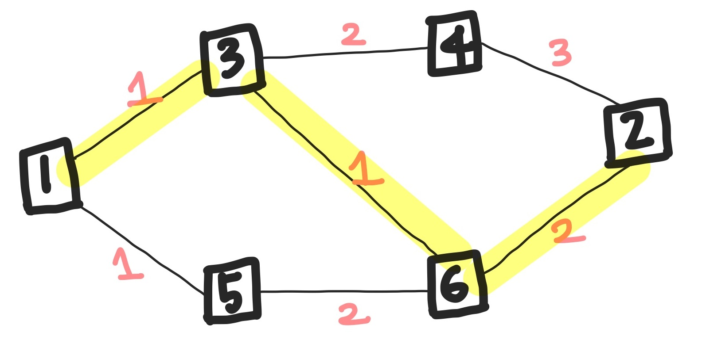

# 2176 합리적인 이동경로

## 문제

그래프의 한 정점 S에서 다른 한 정점 T로 이동하려 한다. **이동할 때 T에 가까워지며 이동하는 경우, 이를 합리적인 이동경로**라 한다. 물론 이러한 경로는 최단경로가 아닐 수도 있다.

그래프가 주어졌을 때 가능한 합리적인 이동경로의 개수를 구하는 프로그램을 작성하시오. S = 1, T = 2 인 경우로 한다.

&nbsp;

> ### 입력

첫째 줄에 정점의 개수 N(1 < N ≤ 1,000), 간선의 개수 M(1 ≤ M ≤ 100,000)이 주어진다.

다음 M개의 줄에는 각 간선에 대한 정보를 나타내는 세 정수 A, B, C가 주어진다. 이는 A번 정점과 B번 정점이 길이 C(0 < C ≤ 10,000)인 간선으로 연결되어 있다는 의미이다. 두 정점은 최대 한 개의 간선으로만 연결될 수 있다. 간선은 방향성이 없다.

&nbsp;

> ### 출력

첫째 줄에 답을 출력한다. 답은 2147483647을 넘지 않는다.

&nbsp;

#

## 풀이

&nbsp;

**현재 노드에서 도착지(T)까지의 거리보다 다음 노드에서 도착지(T)까지의 거리가 짧으면**, 도착지에 가까워지고 있다고 판단하여 **합리적인 이동경로**가 된다.

우선 각 노드에서 도착지(T)로 가는 최단 거리를 구한다. 이후, DFS를 통해 합리적인 이동경로를 찾는데, 무작정 돌리면 시간 초과가 발생하므로 DP를 이용한다.

&nbsp;



위 예시에서 각 노드 별 T까지의 최단 거리는 다음과 같다.

&nbsp;

> distance = {4, 0, 3, 3, 4, 2}

&nbsp;

현재 노드가 1인 경우, 1의 최단 거리(4)와 다음 노드인 5의 최단 거리(4)가 같으므로 1에서 5로 가는 것은 합리적인 이동경로가 아니다. 하지만 3의 최단 거리(3)는 1의 최단 거리보다 작으므로 1 -> 3은 합리적인 이동경로가 될 수 있다.

현재 노드가 3인 경우, 4의 최단 거리(3)는 3의 최단 거리(3)보다 작지 않으므로 1 -> 3 -> 4는 합리적인 이동경로가 아니다. 다른 이웃 노드인 6의 최단 거리(2)는 3보다 작으므로 1 -> 3 -> 6은 합리적인 이동경로가 될 수 있다.

따라서 최종적으로 위 예시에서 가능한 합리적인 이동경로의 개수는 1이며, 1 -> 3 -> 6 -> 2가 해당한다.

&nbsp;

#

## 코드

```java
package week15;

import java.io.BufferedReader;
import java.io.IOException;
import java.io.InputStreamReader;
import java.util.ArrayList;
import java.util.Arrays;
import java.util.Comparator;
import java.util.List;
import java.util.PriorityQueue;
import java.util.StringTokenizer;

public class Main_2176 {
	static final int S = 0;
	static final int T = 1;
	static int N, M;
	static List<int[]>[] graph;
	static int[] distance;
	static int[] dp;

	static void dijksta() {
		PriorityQueue<int[]> pq = new PriorityQueue<>(new Comparator<int[]>() {
			@Override
			public int compare(int[] o1, int[] o2) {
				return Integer.compare(o1[0], o2[1]);
			}
		});
		boolean[] visited = new boolean[N];

		pq.offer(new int[] {T, 0});
		distance[T] = 0;

		while (!pq.isEmpty()) {
			int[] now = pq.poll();

			visited[T] = true;

			for (int[] next : graph[now[0]]) {
				if (visited[next[0]]) {
					continue;
				}

				int newDistance = next[1] + distance[now[0]];
				if (newDistance >= distance[next[0]]) {
					continue;
				}

				distance[next[0]] = newDistance;
				pq.offer(new int[] {next[0], newDistance});
			}
		}
	}

	static int dfs(int now) {
		dp[now] = 0;

		for (int[] next : graph[now]) {
			if (next[0] == T) {
				dp[now]++;
				continue;
			}

            // 합리적인 이동경로의 후보가 되는 경우
			if (distance[next[0]] < distance[now]) {
				if (dp[next[0]] > -1) { // 해당 노드를 이미 방문한 경우
					dp[now] += dp[next[0]];
				} else { // 해동 노드를 방문하지 않은 경우
					dp[now] += dfs(next[0]);
				}
			}
		}

		return dp[now];
	}

    public static void main(String[] args) throws IOException {
    	BufferedReader br = new BufferedReader(new InputStreamReader(System.in));
    	StringTokenizer st = new StringTokenizer(br.readLine());

    	N = Integer.parseInt(st.nextToken());
    	M = Integer.parseInt(st.nextToken());

    	graph = new ArrayList[N];
    	for (int i = 0; i < N; i++) {
			graph[i] = new ArrayList<int[]>();
		}

    	distance = new int[N];
    	Arrays.fill(distance, (int)1e9);

    	dp = new int[N];
    	Arrays.fill(dp, -1);

    	for (int i = 0; i < M; i++) {
			st = new StringTokenizer(br.readLine());

			int s = Integer.parseInt(st.nextToken()) - 1;
			int e = Integer.parseInt(st.nextToken()) - 1;
			int w = Integer.parseInt(st.nextToken());

			graph[s].add(new int[] {e, w});
			graph[e].add(new int[] {s, w});
		}

    	dijksta();
    	dfs(S);

    	System.out.println(dp[S]);
    	br.close();
    }
}
```
