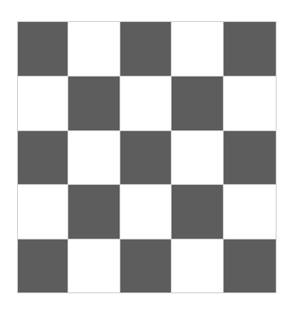
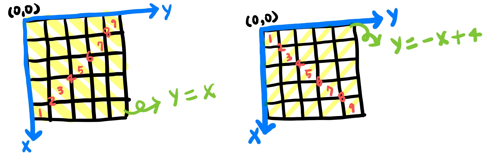
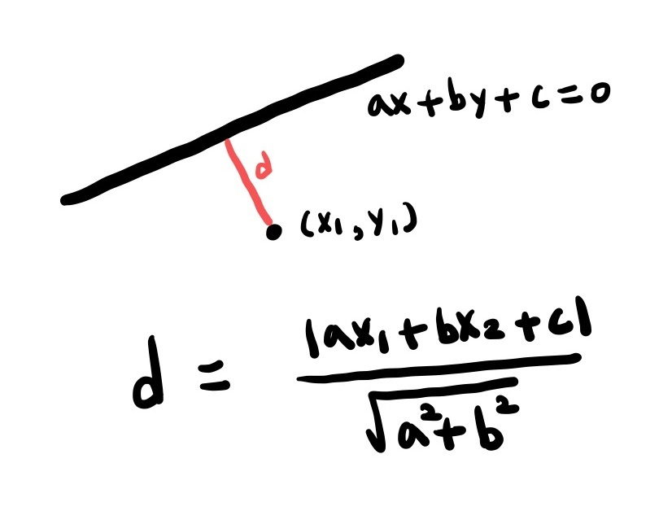

# 1799 비숍

## 문제

서양 장기인 체스에는 대각선 방향으로 움직일 수 있는 비숍(bishop)이 있다. 비숍은 대각선 방향으로 움직여 칸에 있는 다른 말을 잡을 수 있다.

그런데 체스판 위에는 비숍이 놓일 수 없는 곳이 있다. 체스판에 색칠된 부분은 비숍이 놓일 수 없다고 하자. 색칠된 부분에는 비숍이 놓일 수 없지만 지나갈 수는 있다.

정사각형 체스판의 한 변에 놓인 칸의 개수를 체스판의 크기라고 한다. 체스판의 크기와 체스판 각 칸에 비숍을 놓을 수 있는지 없는지에 대한 정보가 주어질 때, 서로가 서로를 잡을 수 없는 위치에 놓을 수 있는 비숍의 최대 개수를 구하는 프로그램을 작성하시오.

&nbsp;

> ### 입력

첫째 줄에 체스판의 크기가 주어진다. 체스판의 크기는 10이하의 자연수이다. 둘째 줄부터 아래의 예와 같이 체스판의 각 칸에 비숍을 놓을 수 있는지 없는지에 대한 정보가 체스판 한 줄 단위로 한 줄씩 주어진다. 비숍을 놓을 수 있는 곳에는 1, 비숍을 놓을 수 없는 곳에는 0이 빈칸을 사이에 두고 주어진다.

&nbsp;

> ### 출력

첫째 줄에 주어진 체스판 위에 놓을 수 있는 비숍의 최대 개수를 출력한다.

&nbsp;

#

## 풀이

비숍을 놓을 수 있는 칸 중 부분집합을 사용하여 최대 개수를 구하려고 했지만 시간 초과가 발생했다.

&nbsp;

시간 초과를 피하려면 위 사진과 같이 검은색과 흰색 두 가지 경우로 나누어 풀어야 한다.

비숍은 대각선으로만 이동하여 공격하기 때문에 상하좌우 방향에 존재하는 칸에 비숍이 있는지 중요하지 않다.

&nbsp;

해당 칸을 지나는 대각선은 위와 같이 두 개씩 존재한다.

각각 몇 번 대각선에 해당하는지는 체스판 크기와 동일한 번호의 직선과 그 칸의 거리를 구해 위치에 따라 더하거나 뺀다.

거리를 구하는 공식은 아래와 같다.

만약, 두 대각선 방향으로 어떤 비숍도 존재하지 않는다면 그 칸에 비숍을 둔다.
