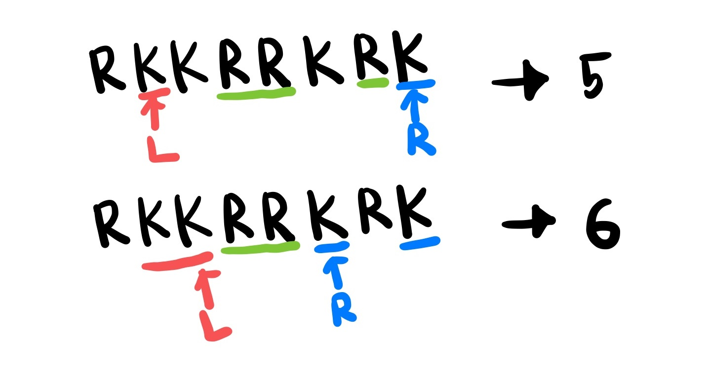

# 20442 ㅋㅋ루ㅋㅋ

## 문제

ㅋㅋ루ㅋㅋ 문자열은 다음과 같이 정의한다.

1. R로만 이루어진 문자열은 ㅋㅋ루ㅋㅋ 문자열이다. 단, 빈 문자열은 ㅋㅋ루ㅋㅋ 문자열이 아니다.
2. ㅋㅋ루ㅋㅋ 문자열 양 끝에 K를 하나씩 붙인 문자열은 ㅋㅋ루ㅋㅋ 문자열이다.

&nbsp;

> ### 입력

첫째 줄에 K와 R로만 이루어진 문자열이 주어진다. 문자열의 길이는 최대 3,000,000이다.

&nbsp;

> ### 출력

주어진 문자열의 부분 수열 중 가장 긴 ㅋㅋ루ㅋㅋ 문자열의 길이를 출력한다. 부분 수열 중 ㅋㅋ루ㅋㅋ인 문자열이 없는 경우, 0을 출력한다.

&nbsp;

#

## 풀이

최대 길이를 구해야 하므로 투 포인터를 활용했다.

이 문제에선 문자열의 일부를 지워 부분 수열을 만들 수 있기 때문에 ㅋㅋ루ㅋㅋ 문자열이 연속적이지 않아도 된다.

&nbsp;

두 포인터가 지나온 K의 개수가 동일할 때, 두 포인터 사이에 R이 존재한다면 ㅋㅋ루ㅋㅋ 문자열이 된다. 이 때 문자열의 길이는 K의 개수를 두 배하고 두 포인터 사이에 있는 R의 개수이다.

포인터를 이동하면서 ㅋㅋ루ㅋㅋ 문자열 양 끝에 K를 하나씩 붙인 문자열의 길이와 K를 모두 지운 문자열의 길이인 R의 총 개수를 비교한다.
