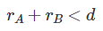

# 22948 원 이동하기 2

## 문제

좌표평면에 원의 중심이 x축 위에 있는
N개의 원이 존재한다.
N개의 원 중 임의의 두개의 원을 선택했을 때 내접, 외접 등 **교점이 존재하지 않도록 존재**한다. **하나의 원이 다른 원 안에 포함될 수는 있다.**

하나의 원 내부에서 다른 원의 내부로 이동하려고 한다. **원 내부는 단 한 번만 방문** 할 수 있으며 두 번 이상 방문을 할 수 없다.

문제 편의상 좌표평면을 원점이 (0, 0)이고 반지름이 무수히 큰 하나의 원이라고 가정하자.

좌표평면에
N개의 원이 있을 때, 원 A 내부에서 원 B 내부로 이동할 때 방문한 원의 개수를 구해보자.

&nbsp;

> ### 입력

첫 번째 줄에는 원의 개수
N이 주어진다.

두 번째 줄부터
N + 1번째 줄까지 원의 번호
k와 원의 중심 좌표 중
x 좌표, 원의 반지름
r이 공백으로 구분되어 주어진다.

마지막 줄에는 두 원의 번호
A와
B가 공백으로 구분되어 주어진다.

주어지는 원의 번호 중 중복되는 수는 없다.

좌표평면의 번호는 0으로 가정한다.

&nbsp;

> ### 출력

첫 번째 줄에는 방문한 원의 개수를 출력한다.

두 번째 줄에는 방문한 원의 번호를 순서대로 공백으로 구분하여 출력한다.

&nbsp;

#

## 풀이

A에서 B로 이동하는 것이므로 A를 감싸고 있는 작은 원들부터 차례대로 이동한 뒤, 두 원을 모두 감싸는 가장 작은 원(좌표 평면 포함)을 지나 B를 감싸고 있는 큰 원에서 작은 원 순서대로 방문할 것이다.

따라서, A를 감싸고 있는 원들과 B를 감싸고 있는 원들을 찾아 각 PQ에 담는다. 이 때, PQ는 반지름의 내림차순으로 정렬한다. 이 문제에선 교점이 없기 때문에 두 원이 겹친다면 반지름이 큰 원이 반지름이 작은 원을 포함하고 있게 된다.

두 원이 포함관계인지 확인할 땐 아래 공식을 활용했다.

&nbsp;

