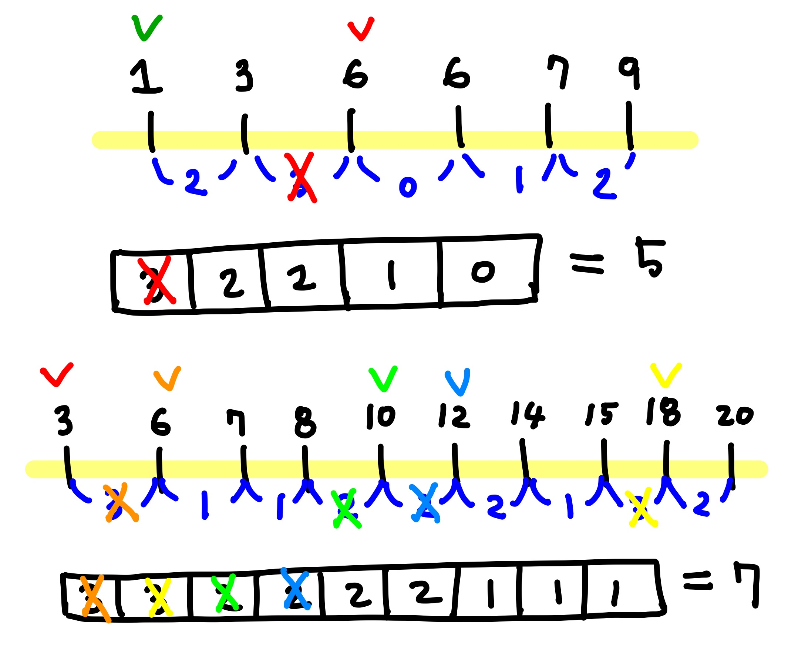

# 2212 센서
## 문제
- 직선 상에 위치하는 N개의 센서 중 각 집중국의 수신 가능 영역 길이 합이 최소가 되는 K개의 집중국 세우기
    - 수신 가능 영역 : 집중국과 집중국에서 가장 먼 센서와의 거리

&nbsp;

---
## 풀이

``` java
int[] diff = new int[N-1];
		
for (int i = 0; i < N-1; i++)
    diff[i] = sensors[i+1] - sensors[i];
```
- 오름차순으로 정렬된 센서들 간 거리를 구한다.

&nbsp;

``` java
int result = sensors[N-1] - sensors[0];
if(N >= 2) {
    for (int i = 0; i < K-1; i++)
        result -= diff[N-2-i];
}
```
- 집중국과 집중국에서 가장 먼 센서와의 거리 총합을 최소로 만들어야 하므로, 각 센서들 간 거리가 가장 큰 곳에 집중국을 설치하여 거리의 합을 줄여나간다.

&nbsp;


- 각 센서는 적어도 하나의 집중국과 통신해야 하므로, 맨 앞에 있는 센서에 집중국을 설치한다.
    - 센서의 수신 가능 영역은 단방향이므로, 왼쪽을 가리키거나 오른쪽을 가리킨다.
    - 맨 앞에 있는 센서에 집중국을 설치하면 수신 가능 영역이 오른쪽은 가리키는 것이며, 맨 뒤에 있는 센서에 설치하면 수신 가능 영역이 왼쪽을 가리키는 것이다.
    - 두 가지 결과가 모두 같다.
- 센서 간 거리가 가장 먼 곳에 설치하면 전체 거리(맨 뒤 센서 - 맨 앞 센서)에서 해당 거리를 포함하지 않는다. 