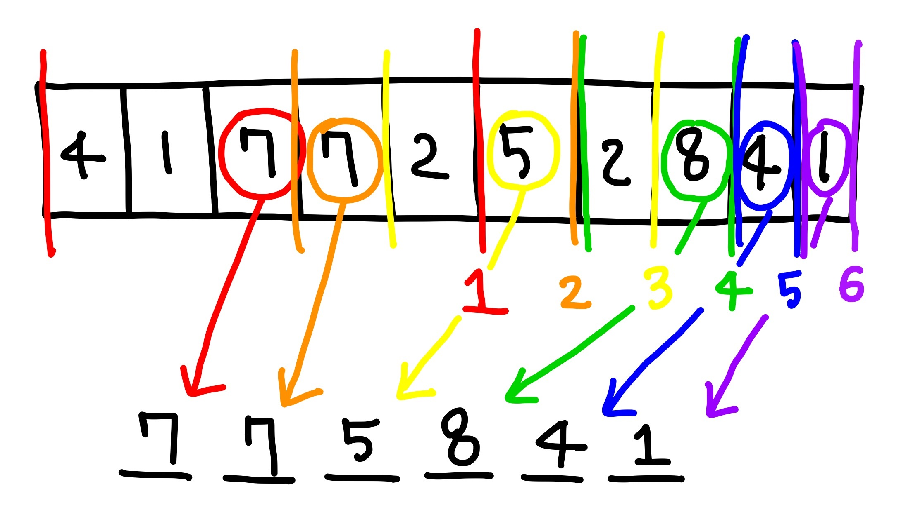

# 2812 크게 만들기
## 문제
- N자리 숫자가 주어졌을 때, 숫자 K개를 지워 얻을 수 있는 가장 큰 수 구하기

&nbsp;

---
## 풀이


- (N-K)자리 중 최댓값을 구하는 것이므로 가능한 범위 내에서 가장 큰 수를 뽑아 해당 인덱스에 넣는다.
- N이 10이고, K가 4인 예시의 경우, 6자릿수 중 최댓값을 구해야 한다. 
    - 첫번째 인덱스에 넣을 숫자는 뒤에서 남은 자릿수인 5를 제외한 범위 내에서 결정한다. 따라서 0 ~ 4(9-5)번째 값 중 제일 큰 7이 첫번째에 위치한다.
    - 두번째 인덱스는 이전에 고른 숫자의 다음 인덱스부터 남은 자릿수인 4를 제외한 범위 3 ~ 5(9-4)번째 값 중 제일 큰 7이 두번째에 위치한다.
    - 남은 인덱스도 반복

&nbsp;

``` java
PriorityQueue<Num> nums = new PriorityQueue<Num>(new Comparator<Num>() {
    @Override
    public int compare(Num o1, Num o2) {
        if(o1.data == o2.data)
            return o1.index - o2.index;
        else
            return -(o1.data - o2.data);
    }
});
```
- 숫자와 인덱스를 갖는 Num 배열 우선순위 큐를 생성한다.
- 위에서 말했듯이 범위 내에서 가장 큰 수를 고를 수 있도록 숫자를 기준으로 내림차순 정렬한다. 만약, 숫자가 같은 경우 앞선 인덱스를 고를 수 있도록 인덱스 기준 오름차순 정렬한다.

&nbsp;

``` java
for (int i = 0; i < K+1; i++)
    nums.offer(new Num(i, snum.charAt(i)-'0'));
```
- 큐에 담겨 있는 값 중 가장 큰 수를 반환하므로 범위 내에서만 조회할 수 있도록 초기엔 K번째 인덱스까지만 큐에 넣는다.

&nbsp;

``` java
int start = 0; // 조회 범위 시작 인덱스
int size = 0;  // 결과값을 넣을 자리
while(size < (N-K)) {
    Num now = nums.poll();

    if (start <= now.index && now.index < (K + size + 1)) {
        result[size++] = now.data;
        start = now.index + 1;
        
        if (K+size < N)
            nums.offer(new Num(K+size, snum.charAt(K+size)-'0'));
    }
}
```
- 큐에서 가장 큰 수가 범위 내에 존재한다면 결과값에 저장
- 다음 자리를 조회하기 전 입력 문자열 중 다음 범위 내 값을 큐에 삽입한다.