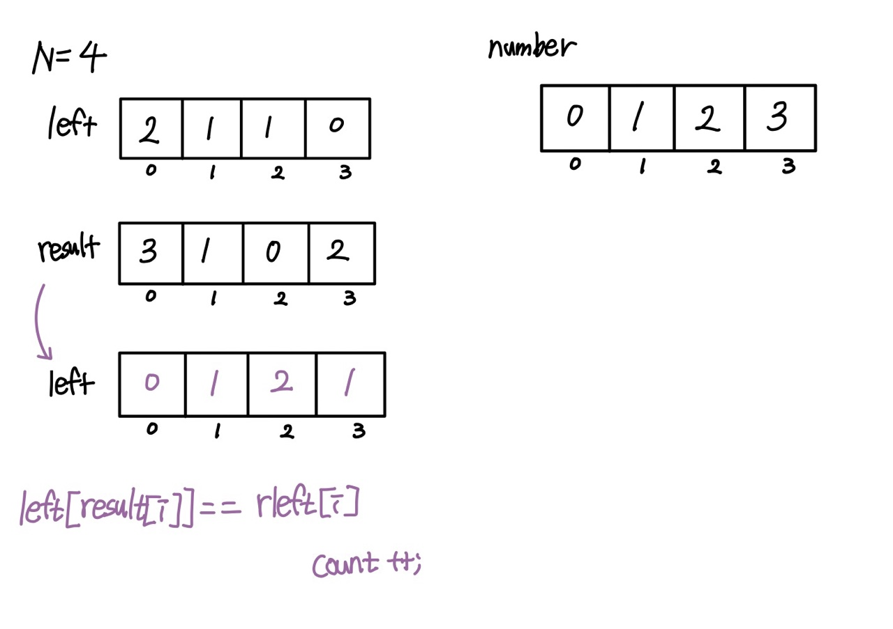

# 1138

</img> 
 
left[] : 문제에서 주어진 배열(왼쪽 사람 수) 
result[] : 재귀돌려서 나온 배열 (0123~3210) 
rleft[] : result 의 왼쪽 큰 사람수 배열(img에 r빼먹음..) 

<pre>
<code>
left[result[i]] == rleft[i]
</code>
</pre>

 

---

 
ArrayList 사용
<pre>
<code>
import java.io.BufferedReader;
import java.io.InputStreamReader;
import java.util.ArrayList;
import java.util.StringTokenizer;

public class Main {

    public static void main(String[] args) throws Exception{
    	BufferedReader br = new BufferedReader(new InputStreamReader(System.in));
    	int N = Integer.parseInt(br.readLine());
    	int [] remember = new int[N];
    	ArrayList <Integer> result = new ArrayList<>();

    	StringTokenizer st = new StringTokenizer(br.readLine());
    	for (int i = 0; i < N; i++) {
    		remember[i] = Integer.parseInt(st.nextToken());
    	}

        //뒤에서부터 i인덱스에 값 추가
    	for (int i = N-1; i >= 0; i--) {
    		result.add(remember[i],i);

    	}
    	for (Integer i : result) {
    		System.out.print((i+1)+" ");
    	}
    }

}
</code>

</pre>
