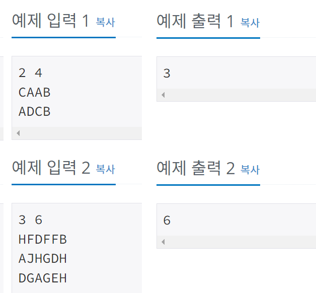

## 1987 - 알파벳

### 문제링크: <https://www.acmicpc.net/problem/1987>

---

### 입력&출력

---

첫째 줄에 R과 C가 빈칸을 사이에 두고 주어진다. (1 ≤ R,C ≤ 20) 둘째 줄부터 R개의 줄에 걸쳐서 보드에 적혀 있는 C개의 대문자 알파벳들이 빈칸 없이 주어진다.  
첫째 줄에 말이 지날 수 있는 최대의 칸 수를 출력한다.
  
</img>  

### 아이디어

---

알파벳 방문 여부를 boolean배열을 생성 & 0~25를 A~Z 라고 생각하고 check
 

<pre>
<code>
public static void dfs(int r, int c, int count) {
	if(visited[board[r][c]]) { //방문했던 알파벳이라면
		result = Math.max(result, count);
		return;
	}
	visited[board[r][c]] = true; //방문했다는 표시를 남기고
	for (int d = 0; d < 4; d++) {
		int nr = r + dr[d];
		int nc = c + dc[d];
			
		if(!check(nr,nc)) continue;
		dfs(nr,nc,count+1); //재귀	
	}
	visited[board[r][c]] = false; //재귀를 벗어났을 때, 방문 취소
}
</code>
</pre>

**해석** 
방문했다는 표시를 남기고, 4방탐색 & 재귀함수 실행 
재귀를 벗어났을 때 해당 알파벳 방문 취소 
종료시점 : 방문했던 알파벳 재 방문시
 
