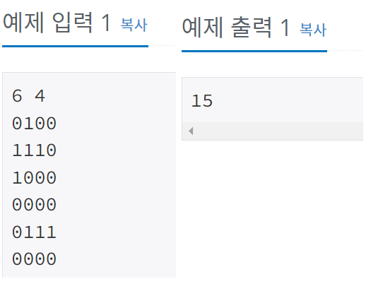

## 2206 - 벽 부수고 이동하기

### 문제링크: <https://www.acmicpc.net/problem/2206>

---

 

### **입력 & 출력**

---

첫째 줄에 N(1 ≤ N ≤ 1,000), M(1 ≤ M ≤ 1,000)이 주어진다. 다음 N개의 줄에 M개의 숫자로 맵이 주어진다. (1, 1)과 (N, M)은 항상 0이라고 가정하자.  
첫째 줄에 최단 거리를 출력한다. 불가능할 때는 -1을 출력한다.  
</img>  

### **아이디어**

---

<pre>
<code>
if(map[nr][nc] == 0) {
	q.offer(new int[] {nr,nc,cur[2],cur[3]+1});
	//map[nr][nc]=2;
}
if(map[nr][nc] == 1) {
	if(cur[2]==1) {
		q.offer(new int[] {nr,nc,cur[2]-1,cur[3]+1});
		//map[nr][nc]=2;
	}
}
</code>
</pre>

**해석** 
길이 뚫려 있으면 큐에 nr,nc,벽뚫여부,이동거리 를 넣음  
길이 막혀 있으면 벽뚫여부 확인 후 이전에 뚫은 경험이 없으면 큐에 nr,nc,벽뚫여부,이동거리를 넣음 
위와 같이 구현 했을 때, 실행하면 while문 안에서 계속 돌아서 메모리초과 뜸  +) 주석부분을 풀면 틀림. . 

> 해결 방법

<pre>
<code>
if(!check(nr,nc))continue;
if(visit[nr][nc][cur[2]]) continue; //방문 안했을시
				
if(map[nr][nc] == 0 && !visit[nr][nc][cur[2]]) { //갈수있는 공간 & 방문하지 않았으면
	q.offer(new int[] {nr,nc,cur[2],cur[3]+1});
	visit[nr][nc][cur[2]] = true;
}
if(map[nr][nc] == 1 && !visit[nr][nc][cur[2]]) { //벽 && 방문하지 않았으면
	if(cur[2]==0) { //이전에 벽을 뿌순적이 없는 경우
	  q.offer(new int[] {nr,nc,1,cur[3]+1});
		visit[nr][nc][1] = true;
	}
}
</code>
</pre>

**해석** 
벽뚫했을때와 안했을때의 방문여부를 따로 두고 방문여부를 표시! 
길이 뚫려 있으면 이전에 뚫은 경험이 없고, 방문이력이 없으면 큐에 nr,nc,벽뚫여부,이동거리를 넣고 방문여부를 남김 
길이 막혀 있으면 방문여부 확인 & 벽뚫여부 확인 후 방문하지 않았고 이전에 벽을 뿌순 이력이 없을 시 큐에 넣고 방문이력을 남김 
