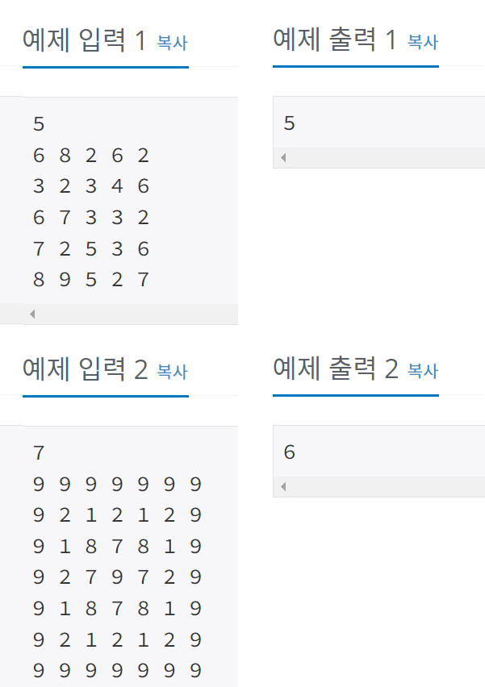

## 2468 - 안전 영역

### 문제링크: <https://www.acmicpc.net/problem/2468>

---

 

### **입력 & 출력**

---

첫째 줄에는 어떤 지역을 나타내는 2차원 배열의 행과 열의 개수를 나타내는 수 N이 입력된다. N은 2 이상 100 이하의 정수이다. 둘째 줄부터 N개의 각 줄에는 2차원 배열의 첫 번째 행부터 N번째 행까지 순서대로 한 행씩 높이 정보가 입력된다. 각 줄에는 각 행의 첫 번째 열부터 N번째 열까지 N개의 높이 정보를 나타내는 자연수가 빈 칸을 사이에 두고 입력된다. 높이는 1이상 100 이하의 정수이다.
  
첫째 줄에 장마철에 물에 잠기지 않는 안전한 영역의 최대 개수를 출력한다.
  
</img>  

### **아이디어**

---

입력 받을 때, 땅 높이의 최소(min), 최대(max)를 입력받고
min~max까지 for문을 돌려 최대 땅 개수를 구한다.

<pre>
<code>
for (int i = min; i < max; i++) {
	Queue<int[]> q = new LinkedList<>();
	boolean [][] check = new boolean[N][N]; //방문 확인배열
	int count = 0;
			
	for (int j = 0; j < N; j++) {
		for (int k = 0; k < N; k++) {
			if(ground[j][k] <= i || check[j][k]) continue; //물높이(i) 보다 땅높이가 작거나같을때 or 배열check면 continue
			count++;
					
			check[j][k] = true;
			q.offer(new int[] {j,k}); //넣고
						
			while(!q.isEmpty()) {
				int a[] = q.poll(); //하나 빼고
						
				for (int d = 0; d < 4; d++) {
					int r = a[0] + dr[d];
					int c = a[1] + dc[d];
							
					if(!check(r,c)) continue;
					if(check[r][c] || ground[r][c] <=i) continue; //이미 방문 했거나 땅높이가 물높이보다 작거나같으면
							
					check[r][c] = true;
					q.offer(new int[] {r,c});
				}
			}
		}
	}
	if(count> result) result =count;		
}
</code>
</pre>

**해석** 
물 높이가 땅 높이보다 작거나 같을때, 또는 배열이 check면 날리고 
아니라면 카운트를 증가 + 그 이후로 영역 확장(큐가 빌 때까지)
