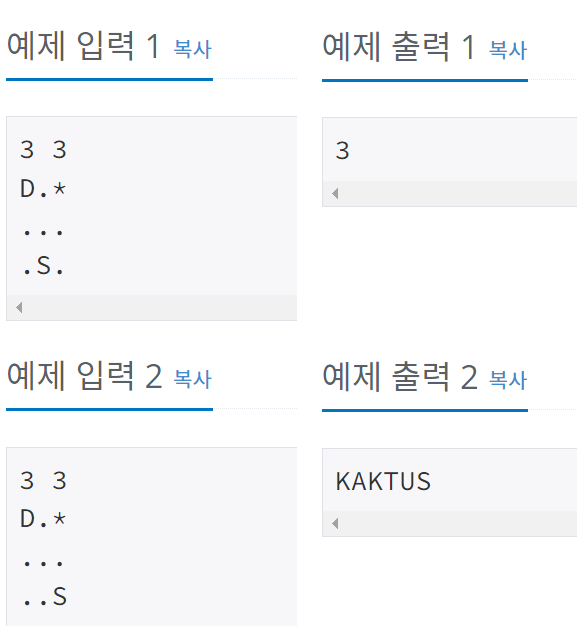

## 3055 - 탈출

### 문제링크: <https://www.acmicpc.net/problem/3055>

---

### **입력**

---

첫째 줄에 50보다 작거나 같은 자연수 R과 C가 주어진다. 
다음 R개 줄에는 티떱숲의 지도가 주어지며, 문제에서 설명한 문자만 주어진다. 'D'와 'S'는 하나씩만 주어진다.  
</img>  

### **아이디어**

---

</img>  

물이 늘어나는 큐+ 물 배열, 고슴도치가 이동하는 큐 + 고슴도치 이동 배열을 만듬  물이 늘어나는 큐를 먼저 실행시킴 -> 물이 차는 시간 배열을 만들어놓고 고슴도치 가 이동할 때 확인해서 진행
 
고슴도치 - 1부터시작 & water 배열이 2보다 큰 배열 만 갈수 있음

 
결과 . . . 메모리초과

 
배열을 너무 많이 만들기 때문에 map 배열안에서 하기로!

<pre>
<code>
while(!hedgeQ.isEmpty()) { //고슴도치 큐가 빌때까지
	int w_len = waterQ.size(); //물 큐 사이즈만큼
			
	for (int i = 0; i < w_len; i++) {
		int[]a = waterQ.poll();
				
		for (int d = 0; d < 4; d++) {
			int nr = a[0]+ dr[d];
			int nc = a[1]+ dc[d];
					
			if(!check(nr,nc)) continue;
			if(map[nr][nc] == 'X' || map[nr][nc] == 'D' || map[nr][nc] == 'S') continue; //돌,도착지점,고슴도치시작위치면
					
			map[nr][nc] = '*'; // map 에 물부분 *저장
			waterQ.offer(new int[] {nr,nc});
		}	
	}
			
	//물 이동 후, 고슴도치 이동
	int h_len = hedgeQ.size();
	for (int i = 0; i < h_len; i++) {
		int[]a = hedgeQ.poll();
		for (int d = 0; d < 4; d++) {
			int nr = a[0]+ dr[d];
			int nc = a[1]+ dc[d];
			int time = a[2];
					
			if(!check(nr,nc)) continue;
			if(map[nr][nc] =='D') { //탈출
				System.out.println(time+1);
				return;
			}
			if(map[nr][nc] == 'X' || map[nr][nc] == '*') continue; //돌이거나 물이있으면
			map[nr][nc] ='S'; //기존위치 고슴도치로 채워줌
			hedgeQ.offer(new int[] {nr,nc,time+1});
		}
				
	}		
}

</code>
</pre>

**해석** 
고슴도치큐과 물 큐 두개를 만들고, 고슴도치 큐가 빌때까지 진행 
물큐먼저 크기를 재고 물큐 한바퀴 굴리고, 고슴도치큐 크기재고 고슴도치 큐 한바퀴 굴림 -> 고슴도치큐가 빌때까지!
 
고슴도치큐는 r,c,이동수 를 큐에 저장(이동수까지 꼭!)
물큐 방문한건 \*로 남기고 고슴도치 방문한건 S표시 남김  
그래도 메모리 초과남. . .
  

<pre>
<code>
if(!check(nr,nc)) continue;
if(map[nr][nc] == '.') {
	map[nr][nc] = '*'; // map 에 물부분 *저장
	waterQ.offer(new int[] {nr,nc});
}
if(map[nr][nc] == '.') {
	map[nr][nc] ='S'; //기존위치 고슴도치로 채워줌
	hedgeQ.offer(new int[] {nr,nc,time+1});
}
</code>
</pre>

**해석** 
map 검사를 이동할 수 있는 '.' 일시로 수정
