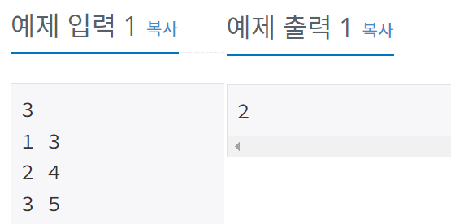

## 11000 - 강의실 배정

### 문제링크: <https://www.acmicpc.net/problem/11000>

---

### 입력&출력

---

첫 번째 줄에 N이 주어진다. (1 ≤ N ≤ 200,000) 
이후 N개의 줄에 Si, Ti가 주어진다. (0 ≤ Si < Ti ≤ 109)  
강의실의 개수를 출력하라.
  
</img>  

### 아이디어

---

수업 시간을 오름차순으로 정렬 후, 우선순위 큐에 넣어 큐의 크기를 출력
 

<pre>
<code>
//입력
time = new int[N][2]; //[N][0]: 시작 시간 , [N][1]: 끝나는 시간

//오름차순 정렬
Arrays.sort(time,(a,b)->{
	if(a[0]==b[0])
		return Integer.compare(a[1], b[1]);
	else
		return Integer.compare(a[0],b[0]);
});

//우선순위 큐
PriorityQueue<Integer> q = new PriorityQueue<>();
q.add(time[0][1]); //첫번째 강의의 끝나는 시간 넣음
for (int i = 1; i < N; i++) {
	//가장 작은 종료 시간과 강의 시작시간을 비교 
	if(q.peek()<=time[i][0]) {
		q.poll();
	}
	q.add(time[i][1]);
}
System.out.println(q.size());

</code>
</pre>

**해석** 
시작 시간을 기준으로 오름차순으로 정렬 
다음 강의의 시작시간과 우선순위 큐 안에서의 종료시각이 가장 빠른 강의와 비교 
종료시각이 가장빠른 강의보다 시작시간이 늦다면 top 강의를 제거 
종료시각 큐 추가
 
