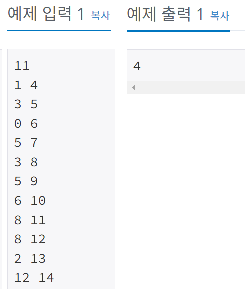
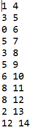

## 1931 - 회의실 배정

### 문제링크: <https://www.acmicpc.net/problem/1931>

---

### 입력&출력

---

첫째 줄에 회의의 수 N(1 ≤ N ≤ 100,000)이 주어진다. 
둘째 줄부터 N+1 줄까지 각 회의의 정보가 주어지는데 이것은 공백을 사이에 두고 회의의 시작시간과 끝나는 시간이 주어진다. 
시작 시간과 끝나는 시간은 231-1보다 작거나 같은 자연수 또는 0이다  
첫째 줄에 최대 사용할 수 있는 회의의 최대 개수를 출력한다.
  
</img>  

### 아이디어

---

수업 시간을 오름차순으로 정렬 후, 모든 배열을 순회하면서 끝나는시간이 시작시간보다 같거나 작으면 카운트를 올리고 끝나는시간을 바꿔줌
 

<pre>
<code>
//입력
timeTable = new int[N][2]; //[N][0]: 시작 시간 , [N][1]: 끝나는 시간

//오름차순 정렬
Arrays.sort(time,(a,b)->{
	if(a[0]==b[0])
		return Integer.compare(a[1], b[1]);
	else
		return Integer.compare(a[0],b[0]);
});

int count = 0;
int end_time = 0;
//모든 배열 순회
for (int i = 0; i < N; i++) {
	//끝나는시간이 시작시간보다 같거나 작으면
	if(end_time <= timeTable[i][0]) {
		//카운트 올리고 끝나는시간을 바꿔준다
		count++;
		end_time = timeTable[i][1];
	}
}
System.out.println(count);

</code>
</pre>

**해석**  
</img> 
시작 시간을 기준으로 오름차순으로 정렬 
끝나는시간과 카운트를 0으로 초기화 
모든 배열을 순회 하면서 끝나는시간이 배열의 시작시간보다 같거나 작으면 카운트를 올리고 끝나는시간을 바꿔줌 
모든 배열 순회 후 카운트 출력
 
