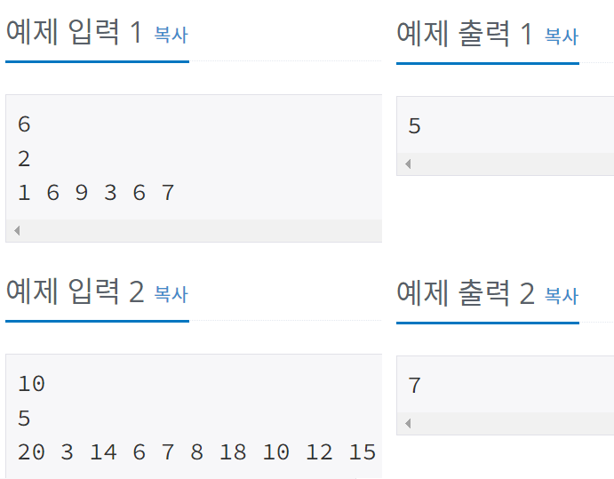
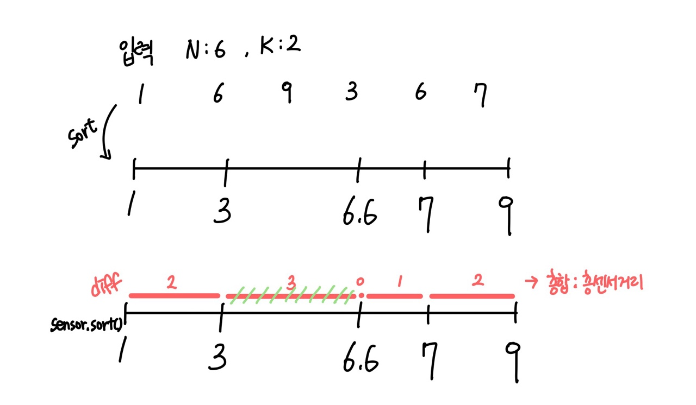

## 2212 - 센서

### 문제링크: <https://www.acmicpc.net/problem/2212>

---

### 입력&출력

---

첫째 줄에 센서의 개수 N(1 ≤ N ≤ 10,000), 둘째 줄에 집중국의 개수 K(1 ≤ K ≤ 1000)가 주어진다. 
셋째 줄에는 N개의 센서의 좌표가 한 개의 정수로 N개 주어진다. 
각 좌표 사이에는 빈 칸이 하나 있으며, 좌표의 절댓값은 1,000,000 이하이다.  
첫째 줄에 문제에서 설명한 최대 K개의 집중국의 수신 가능 영역의 길이의 합의 최솟값을 출력한다.
  
</img>  

### 아이디어

---

</img>  
센서 배열을 오름차순 정렬 후, 차이 배열을 구해서 큰수부터 K-1개 까지 제외하고 나머지 diff를 더함
 

<pre>
<code>
//입력
senser = new int[N]; //센서 배열
diff = new int[N-1]; //센서 거리차이 배열

//오름차순 정렬후, 차이배열값 넣어주기
Arrays.sort(senser);
diff = new int[N-1];
for (int i = 0; i < N-1; i++) {
	diff[i] = senser[i+1]-senser[i];
}
		
//차이 오름차순 정렬 후, N-K개까지 합 구하기
Arrays.sort(diff);
int result = 0;
for (int i = 0; i < N-K; i++) {
	result += diff[i];
}
System.out.println(result);

</code>
</pre>

**해석** 
센서 배열을 오름차순으로 정렬 
센서배열에 대한 거리 차이 배열을 작성 
거리 차이 배열을 오름차순 정렬 후 0 ~ (N-K)개 까지 합 구하기 
 
