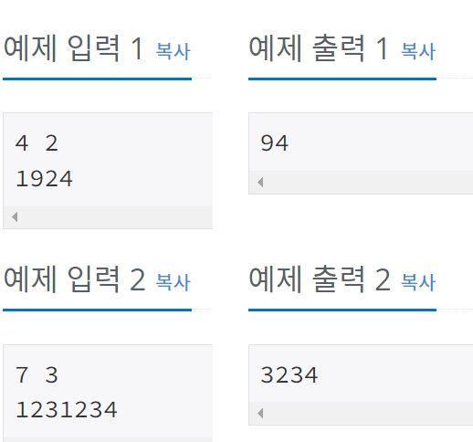

## 2812 - 크게 만들기

### 문제링크: <https://www.acmicpc.net/problem/2812>

---

### 입력&출력

---

첫째 줄에 N과 K가 주어진다. (1 ≤ K < N ≤ 500,000) 
둘째 줄에 N자리 숫자가 주어진다. 이 수는 0으로 시작하지 않는다.
  
입력으로 주어진 숫자에서 K개를 지웠을 때 얻을 수 있는 가장 큰 수를 출력한다.
  
</img>  

### 아이디어

---

만들어진 숫자의 끝자리를 확인하고 삭제하는 방법을 사용해 Stack 자료구조 사용
 

<pre>
<code>
//입력 number배열(int)로 입력받음
number = new int[N];
String s = br.readLine();
for (int i = 0; i < N; i++) {
	number[i] = Integer.parseInt(s.charAt(i)+"");
}

Stack<Integer> stack = new Stack<>();
int count = 0;
for (int i = 0; i < N; i++) {
	int curnum = number[i];
	//숫자를 더 지울 수 있고, 스택에 들어있는 값(top)보다 클때 제거
	while(!stack.isEmpty() && count < K && stack.peek() < curnum) { 
		stack.pop();
		count++;
	}
	stack.push(curnum);
}

//N-K개까지만 출력(count 가 K개가 되지 않더라도 뒤에것 자름)
for (int i = 0; i < N-K; i++) {
	sb.append(stack.get(i));
}

</code>
</pre>

**해석** 
stack에 각 자리의 숫자를 추가해주는 방식 
추가하기 전에 stack의 top과 비교를 하고 현재 수가 더 크다면 top에 있는 숫자 삭제 후 추가 + 아니라면 그냥 추가 
count가 K개가 되면 삭제후 추가 불가능 
count == K 가 아닐수도 있기 때문에 N-K개 까지만 출력 
반례 : 7 3 7654321 //answer: 7654
