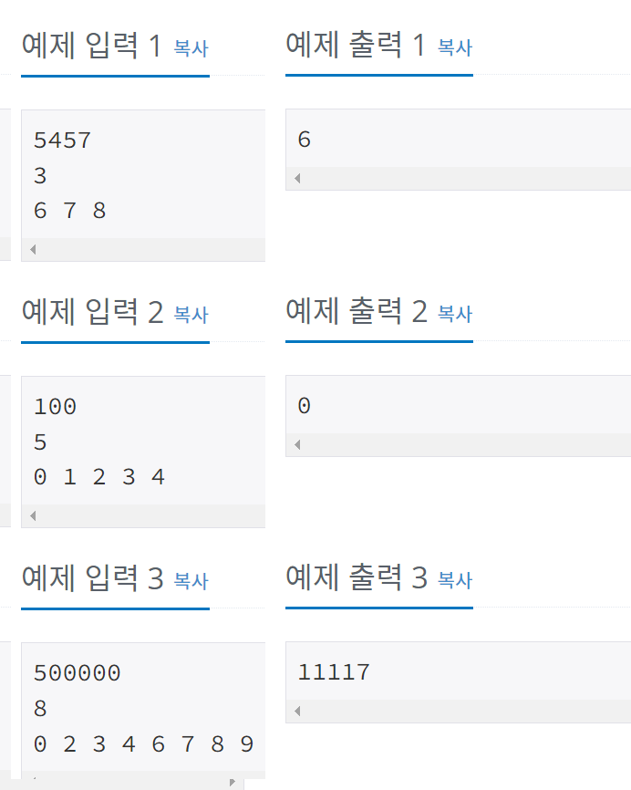

## 1107 - 리모컨

### 문제링크: <https://www.acmicpc.net/problem/1107>

---

### 입력&출력

---

첫째 줄에 수빈이가 이동하려고 하는 채널 N (0 ≤ N ≤ 500,000)이 주어진다. <br>
둘째 줄에는 고장난 버튼의 개수 M (0 ≤ M ≤ 10)이 주어진다. <br>
고장난 버튼이 있는 경우에는 셋째 줄에는 고장난 버튼이 주어지며, 같은 버튼이 여러 번 주어지는 경우는 없다.<br><br>
첫째 줄에 채널 N으로 이동하기 위해 버튼을 최소 몇 번 눌러야 하는지를 출력한다.
<br><br>
</img><br><br>

### 아이디어

---

1. 100에서부터 -,+ 버튼을 누른경우.
2. 자릿수-1 을 제일 크게 만들어서 +버튼을 누르는경우
3. 자릿수 +1 을 제일 작게 만들어서 - 버튼을 누르는 경우
4. 자릿수 대로 모든 경우의 수를 만드는 경우<br>

위 경우를 모두 적용 해 보고 제일 작게 움직인 버튼 수 출력<br>

<br>

```java
//1번 경우
result = Math.abs(N-100);
//2번 경우
digitM();
static void digitM() {
	//digit-1 자리 : 최대한 크게 만들어서 비교
	if(digit-1 == 0) return; //자릿수가0이면 리턴
	int answer = digit-1; //초깃값(digit-1)번 누르고 시작
	int make = 0;
	for (int i = digit-2; i >= 0; i--) {
		make += maxB*Math.pow(10, i);
	}
	answer += Math.abs(N-make);
	result = Math.min(result, answer);
}
//3번 경우
digitP();
static void digitP() {
	//digit+1 자리 :최대한 작게 만들어서 비교
	if(minB == 0) {//0제외한 제일 작은 수가 0일경우 return
		if(M==10) { //모든숫자 못치는 경우
			int answer = Math.abs(N-100);
			result = Math.min(result, answer);
			return;
		}
    //0만 칠 수 있는 경우
		int answer = 1+ N;
		result = Math.min(result, answer);
		return;
	}
	int answer = digit+1;
	int make = 0;
	for (int i = digit; i >= 0; i--) {
		if(i!= digit && button[0]== true) {
			continue;
		}
		make += minB*Math.pow(10, i);
	}
	answer += Math.abs(N-make);
	result = Math.min(result, answer);
}
//4번 경우
digitE(0);
static void digitE(int cnt) {
	//모든 경우의 수 돌리기
	if(cnt == digit) {
		int answer = digit;
		int make = 0;
		for (int i = 0; i < digit ; i++) {
			make += choice[i]*Math.pow(10,digit-1-i);
		}
		answer += Math.abs(N-make);
		result = Math.min(result, answer);
		return;
	}
	for (int i = 0; i < button.length; i++) {
		if(button[i] == false) continue;
		choice[cnt] = i;
		digitE(cnt+1);
		choice[cnt] = 0;
	}
}


```
