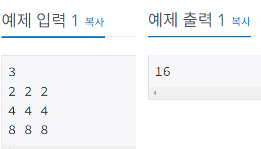

## 12100 - 2048 (Easy)

### 문제링크: <https://www.acmicpc.net/problem/12100>

---

### 입력&출력

---

첫째 줄에 보드의 크기 N (1 ≤ N ≤ 20)이 주어진다.<br>
둘째 줄부터 N개의 줄에는 게임판의 초기 상태가 주어진다.<br>
0은 빈 칸을 나타내며, 이외의 값은 모두 블록을 나타낸다.<br>
블록에 쓰여 있는 수는 2보다 크거나 같고, 1024보다 작거나 같은 2의 제곱꼴이다.<br>
블록은 적어도 하나 주어진다. <br><br>
최대 5번 이동시켜서 얻을 수 있는 가장 큰 블록을 출력한다.
<br><br>
</img><br><br>

### 아이디어

---

위, 아래 , 왼, 오 방향으로 중복순열을 돌림 4^5번(모든 경우의 수)<br>

1. 기존 입력 받은 배열을 그대로 두고
2. 돌리기 전에 copy1에 복사
3. copy2에 복사 하고 copy1에 값 옮김 (반복)<br>

<br>

```java
//로직
perm(0);

static void perm(int cnt) {
	if(cnt== moveCnt) {
		//board -> copy1 복사
		for (int i = 0; i < N; i++) {
			System.arraycopy(board[i], 0, copy1[i], 0, board[0].length);
		}

		for (int i = 0; i < moveCnt; i++) {
			//copy1 -> copy2 복사
			for (int j = 0; j < N; j++) {
				System.arraycopy(copy1[j], 0, copy2[j], 0, copy1[0].length);
			}
			if(move[i] == 0)
				moveUp();
			if(move[i] ==1)
				moveRight();
			if(move[i] ==2)
				moveDown();
			if(move[i] ==3)
				moveLeft();

			}
		//다 돌리고 최댓값 계산
		for (int i = 0; i < N; i++) {
			for (int j = 0; j < N; j++) {
				result = Math.max(result, copy1[i][j]);
			}
		}
		return;
	}
	for (int i = 0; i < 4; i++) {
		move[cnt] = i;
		perm(cnt+1);
		move[cnt] = 0;
	}
}

//move로직 - moveLeft
static void moveLeft() {
	for (int i = 0; i < N; i++) {
		int index = 0;
		for (int j = 0; j < N; j++) {
			if(copy2[i][j] == 0) continue;
			boolean isSame = false;

			for (int k = j+1; k < N; k++) {
				if(copy2[i][k] == 0) continue;
				if(copy2[i][j] == copy2[i][k]) {
					copy1[i][index++] = 2*copy2[i][j];
					j = k;
					isSame = true;
					break;
				}
				//다른걸 만났을 경우
				break;
			}
			if(isSame == false) {
				copy1[i][index++] = copy2[i][j];
			}
		}
		for (int j = index; j < N; j++) {
			copy1[i][j] = 0;
		}
	}
}
```

**해석**<br><br>

moveLeft 로직 해석<br>

1. row 기준 col = 0 부터 탐방, index = 0 초기화
2. isSame = false 처리 (같은걸 만났다는 표시)
3. k 는 j+1 부터 탐방해서 0 이면 continue, 같은걸 만난다면 index 자리에 2를 곱한 값을 넣어줌
4. j 에 k 값을 넣어줌(j가 같으니 하나 건너뛰고 탐색), isSame = true 해주고 break
5. 0이거나 같은 값이 아니면 무조건 다른 값 이므로 break처리
6. 같은걸 만나지 못했을 경우 index값에 본인 값을 넣어줌
7. index ~ 끝까지 0값 넣어줌(아무것도 없다.)

<br>
for k문 돌리는 이유 : 바로옆 index랑 비교하는 경우 확인 불가능해서 ex)2 0 0 2
