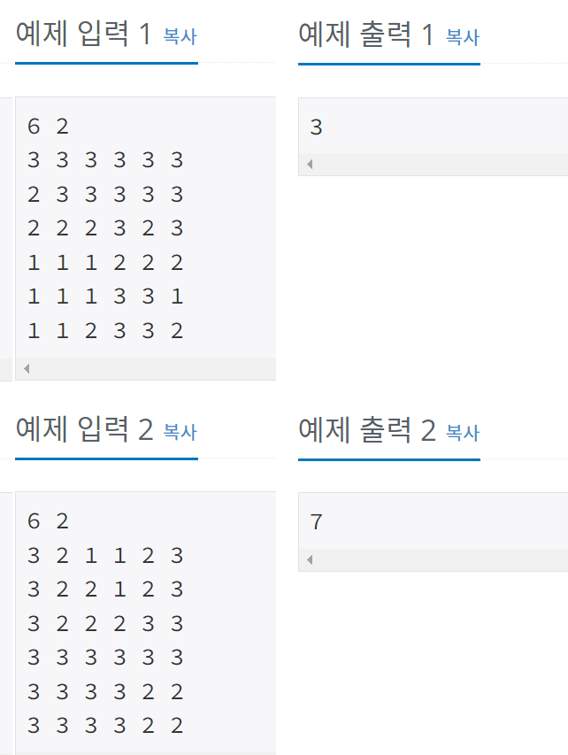

## 14890 - 경사로

### 문제링크: <https://www.acmicpc.net/problem/14890>

---

### 입력&출력

---

첫째 줄에 N (2 ≤ N ≤ 100)과 L (1 ≤ L ≤ N)이 주어진다.<br>
둘째 줄부터 N개의 줄에 지도가 주어진다.<br>
각 칸의 높이는 10보다 작거나 같은 자연수이다.<br><br>
첫째 줄에 지나갈 수 있는 길의 개수를 출력한다.
<br><br>
</img><br><br>

### 아이디어

---

1. 각 행과 열을 모두 탐색한다.
2. 행 탐색 -> cnt(열 index) 를 들고가다가 N-1에 도착했을 때 result값 증가
3. 열도 같은식으로 진행해줌

<br>

```java
//행 탐색
for (int i = 0; i < N; i++) {
	acc = 1;
	go1(i,0,false); //행index, 열index, keep여부
}

static void go1(int row, int cnt, boolean keep) {
	if(keep==true) { //keep이 true 일 때, 누적값이 L 값보다 크거나 같으면(이동할 수 있으면) 누적 값 초기화 하고 false로 바꿔줌
		if(acc>=L) {
			acc=0;
			go1(row,cnt,false);
			return;
		}
	}
	if(cnt==N-1) {
		if(keep==false) {
			result++;
		}
		return;
	}

	//다음 거 높이 같을 때
	if(map[row][cnt] == map[row][cnt+1]) {
		acc++; //누적값증가
		go1(row, cnt+1, keep);
	}

	//다음 거 높이 낮을 때, keep=false일 때 (keep=true인 상태로 또 못내려감)
	if(map[row][cnt] == map[row][cnt+1]+1 && keep == false) {
		acc =1; //누적 값 1로 초기화
		go1(row, cnt+1, true); //일단 이동, 보류라는 의미로 keep=true;
	}

	//다음 거 높이 높을 때
	if(map[row][cnt] == map[row][cnt+1]-1) {
		if(acc>=L) { //누적값이 L보다 높으면 누적값 초기화 하고 올라갈 수 있음
			acc =1;
			go1(row, cnt+1, keep);
		}
	}
}


```
