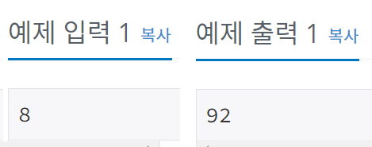
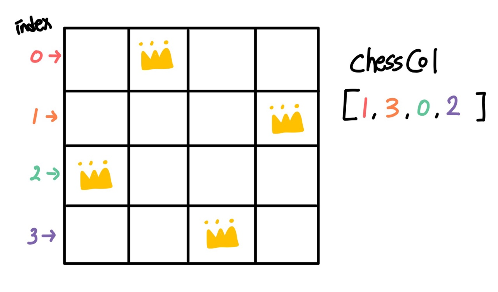

## 9663 - N-Queen

### 문제링크: <https://www.acmicpc.net/problem/9663>

---

### 입력&출력

---

첫째 줄에 N이 주어진다. (1 ≤ N < 15)<br><br>
첫째 줄에 퀸 N개를 서로 공격할 수 없게 놓는 경우의 수를 출력한다.
<br><br>
</img><br><br>

### 아이디어

---

</img><br>
queen 위치의 행을 index, 열을 값을 이용해 1차원 배열로 풀 수 있다.<br>
세로열 비교는 값비교, 대각선 비교는 절댓값을 이용한 기울기 비교를 통해서 할 수 있다.<br>

<br>

```java
//입력
chessCol = new int[N]; //인덱스 : 행, 값: 열

queen(0);
System.out.println(result);

static void queen(int depth) {
		//모두 탐색했을 경우
		if(depth == N) {
			result++;
			return;
		}

		//해당 열의 모든 경우를 탐색 & 놓을 수 있으면 다음 열로
		for (int i = 0; i < N; i++) {
			chessCol[depth] = i;
			if(isPossible(depth))
				queen(depth+1);
		}
}

static boolean isPossible(int col) {
		for (int i = 0; i < col; i++) {
			//해당 열과 i열의 행이 일치 -> false(세로 겹침)
			if(chessCol[col] == chessCol[i])
				return false;
			//대각선(기울기 절댓값이  1인 경우)
			if(Math.abs(col-i) == Math.abs(chessCol[col]-chessCol[i]))
				return false;
		}
		//어느 부분도 겹치지 않으면
		return true;
}

```

**해석**<br><br>

depth(행) 0부터 N까지 모든 열 탐색<br>
chessCol에 값을 넣고 queen을 배치 할 수 있는지 함수 호출(isPossible)<br>
세로 겹치는경우, 대각선 겹치는 경우 일 때 return false 처리<br>
queen을 배치할 수 있다면 depth+1 <br>
depth가 N 이 되었다면, queen 배치가 완료 되었다는 뜻이므로 result++ <br>
