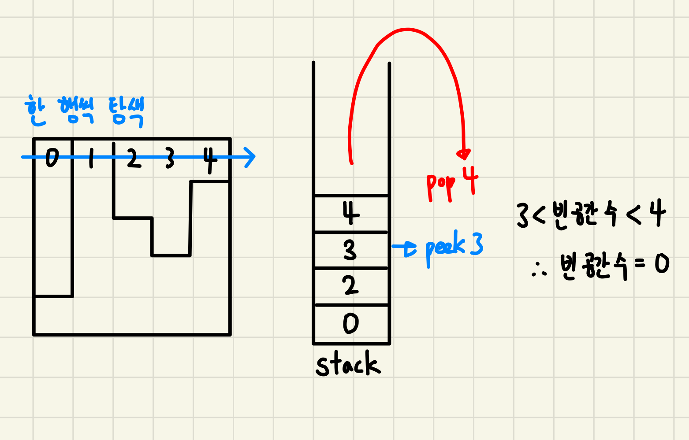

## 14719 - 빗물🌧️

#
### 문제 설명
***  
- 2차원 세계에 블록들이 쌓여있다. 블록과 블록 사이에는 빗물이 고인다.


- 고이는 빗물의 총량은 얼마인가? (한 칸당 용량은 1)

##
### 입력
***
- 첫째줄: 세로의 길이 = H, 가로의 길이 = W `(1 <= H, W <= 500)`


- 둘째줄: 블록이 쌓인 높이, (2차원 세계의 맨 왼쪽부터)
  

- 2차원 세계의 바닥은 항상 막혀있다.


##
### 아이디어
***

- 첫째줄과 둘째줄에 주어진 값으로 2차원 배열을 생성한다. (배닥면이 위를 향하도록 뒤집어서 생성)
  - 블록이 있는 부분은 1
  - 블록이 없는 부분은 0
    ```
    1 0 1 1 1
    1 0 1 1 0
    1 0 0 1 0
    0 0 0 0 0
    ```
###
1. 한 행씩 탐색을 하면서 블럭이 있는 곳의 열 index를 stack에 push한다.
   - 블럭이 있는 부분 = 2차원 배열 요소 값이 1
  
### 
2. stack이 빌 때까지 요소를 꺼내면서
   - 방금 꺼낸 index와 다음에 꺼낼 index 사이에 빈 공간이 몇 개 있는지 계산한다. 
### 

   
  

3. 모든 행을 탐색할 때까지 1,2를 반복한다.
***
#
#
#
