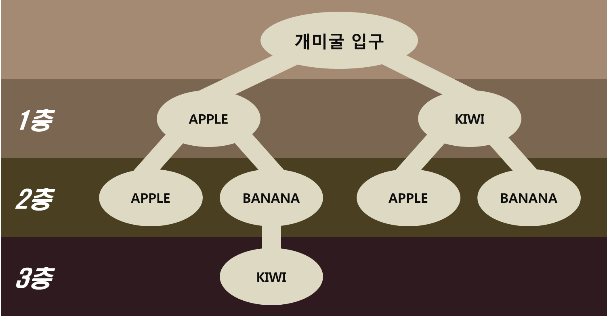

# 백준 14725 - 개미굴

---

## 구현 목표

아래와 같은 구조를 가지는 개미굴에 충분히 많은 로봇 개미를 내려보내어 개미굴의 구조를 파악하고자 한다.

로봇 개미는 더 이상 내려갈 수 없는 위치까지 내려간 다음 그 자리에서 지금까지 지나온 먹이들에 대한 정보를 보낸다.

로봇 개미들이 보내준 정보를 바탕으로 개미굴의 구조를 출력해야 한다.



---

## 풀이 방식

예전에 한번 풀어봤던 트라이 자료구조를 이용한 문제였다. 풀이 방식은 다음과 같다.

1. 아래와 같은 클래스를 생성한다
``` Java
static class Node implements Comparable<Node> {
    String parent;		// 부모 층
    ArrayList<Node> children = new ArrayList<>(); 	// 한 단계 아래의 자식 층
    
    public Node() {}

    public Node(String parent) {
        super();
        this.parent = parent;
    }

    @Override
    public int compareTo(Node o) {
        return this.parent.compareTo(o.parent);		// 같은 층일때는 알파벳 순서
    }
}
```

2. 로봇 개미가 보내준 정보(단어의 배열 형태)가 들어올 때마다 포인터를 가장 최상위 노드로 이동시킨다.

3. 단어의 배열을 처음부터 읽으며, 현재 위치한 노드의 children 리스트에 지금 읽은 단어가 있는지 확인한다.

4. 단어가 존재한다면 포인터를 해당 단어 노드로 이동시키고 다음 단어로 넘어간다.

5. 단어가 존재하지 않는다면 새로운 먹이의 정보를 담은 노드를 생성하여 children 리스트에 새로 생성한 노드를 추가한다.

6. dfs 방식으로 -- 를 추가하여 계층을 구분해주고, 함수가 호출될 때마다 Collections.sort()를 활용하여 children 리스트를 사전순으로 정렬해준다.

``` Java
private static void print(Node nest, int cnt) {
    Collections.sort(nest.children);	// 사전순으로 정렬
    
    for (int i = 0; i < nest.children.size(); i++) {
        for (int j = 0; j < cnt; j++) {
            sb.append("--");	// 계층 구분
        }
        sb.append(nest.children.get(i).parent).append("\n");
        print(nest.children.get(i), cnt+1);
    }
}
```

---
