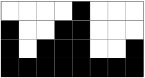
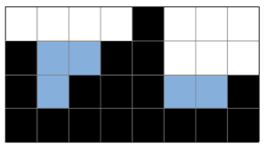
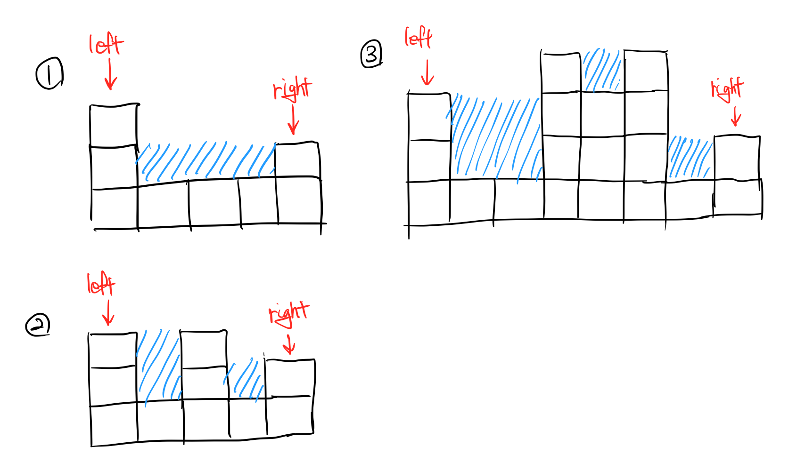

# 14719 - 빗물
## 문제
### 설명
2차원 세계에 블록이 쌓여있다. 비가 오면 블록 사이에 빗물이 고인다.




비는 충분히 많이 온다. 고이는 빗물의 총량은 얼마일까?

### 입력
첫 번째 줄에는 2차원 세계의 세로 길이 H과 2차원 세계의 가로 길이 W가 주어진다. (1 ≤ H, W ≤ 500)

두 번째 줄에는 블록이 쌓인 높이를 의미하는 0이상 H이하의 정수가 2차원 세계의 맨 왼쪽 위치부터 차례대로 W개 주어진다.

따라서 블록 내부의 빈 공간이 생길 수 없다. 또 2차원 세계의 바닥은 항상 막혀있다고 가정하여도 좋다.


## 풀이
### 코드
```java
import java.io.BufferedReader;
import java.io.IOException;
import java.io.InputStreamReader;
import java.util.Arrays;
import java.util.List;
import java.util.stream.Collectors;

public class Main14719 {
    public static void main(String[] args) throws IOException {
        BufferedReader br = new BufferedReader(new InputStreamReader(System.in));

        String[] hw = br.readLine().split(" ");
        List<Integer> blocks = Arrays.stream(br.readLine().split(" "))
                .map(Integer::parseInt)
                .collect(Collectors.toList());
        int h = Integer.parseInt(hw[0]);
        int w = Integer.parseInt(hw[1]);

        int left = 0;
        int right = w-1;

        int answer = 0;
        while (left < right) {
            int leftBlockHeight = blocks.get(left);
            int rightBlockHeight = blocks.get(right);

            int water = 0;
            if (leftBlockHeight <= rightBlockHeight) {
                while (left < right && blocks.get(left) <= leftBlockHeight) {
                    left++;
                    if (leftBlockHeight - blocks.get(left) <= 0) {
                        continue;
                    }
                    water += leftBlockHeight - blocks.get(left);
                }
            }

            if (leftBlockHeight > rightBlockHeight) {
                while (left < right && blocks.get(right) <= rightBlockHeight) {
                    right--;
                    if (rightBlockHeight - blocks.get(right) <= 0) {
                        continue;
                    }
                    water += rightBlockHeight - blocks.get(right);
                }
            }
            answer += water;
        }
        System.out.println(answer);
    }
}

```

### 과정
- 투포인터를 활용하여 풀이

1. left와 right 포인터를 잡고 더 작은 포인터가 이동하도록 설정
    - 처음 잡은 포인터는 변수에 각각 저장
2. 포인터가 이동하면서 기존에 저장된 포인터와 비교하며 더 큰 값이 나타나면 멈추고 포인터 재설정
3. 다시 1번으로 돌아가서 반복
4. left >= right 상태가 되면(left와 right가 만나면) 반복 종료